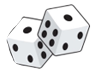
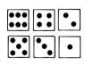
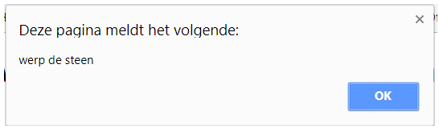
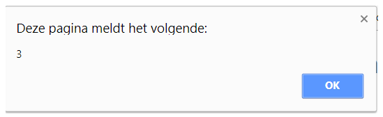

# Roll The Dice - Opdracht Kennismakingsdag

## Doelstelling

Het aanpassen van een HTML-pagina met daarin CSS en Javascript code zodat deze weer naar behoren werkt.

## Opdracht

In deze opdracht begin je met een webpagina waar een dobbelsteen op wordt getoond. Deze dobbelsteen doet nog niets; het is de bedoeling dat je deze laat rollen door op de knop te drukken. Aan jou de taak om uit te zoeken hoe je dit voor elkaar krijgt.

## Benodigd Materiaal

- Een PC / Mac met een code-/teksteditor ([Notepad++](https://notepad-plus-plus.org/downloads/)Notepad++, Sublime, UltraEdit).
- Een webbrowser (Chrome, Firefox, Edge).
- Het internet (om dingen op te zoeken).
- Het stappenplan.

## Bestandenstructuur

De benodigde bestanden kun je terugvinden op de USB-stick of op je computer. Het is verstandig om de inhoud van de USB-stick ergens op je harde schijf te kopiëren.

```
│   dice.html
└───[Images]
        1.jpg
        2.jpg
        3.jpg
        4.jpg
        5.jpg
        6.jpg
        round_dice_1.png
        round_dice_2.png
        round_dice_3.png
        round_dice_4.png
        round_dice_5.png
        round_dice_6.png
```

## Werking van het HTML-bestand

Het bestand `dice.html` bevat HTML in combinatie met CSS en Javascript. Je kunt dit bestand openen in een webbrowser om te zien hoe het eruitziet. De broncode kan bekeken worden met een teksteditor zoals Notepad++.

### Belangrijke Code Secties

- **CSS-code**: Staat tussen `<style> ... </style>`-tags.
- **HTML-code**: Staat tussen `<body> ... </body>`-tags.
- **Javascript-code**: Staat tussen `<script> ... </script>`-tags.

De HTML-code bepaalt de structuur van de pagina, de CSS-code zorgt voor de styling en de Javascript-code bevat de logica, zoals het stoppen van de dobbelsteen en de keuze van het nummer.

## Level 1 - Opdrachten

### Stap 1: Correcte afbeeldingen toevoegen

Op dit moment worden groene, ronde afbeeldingen weergegeven op de zijden van de dobbelsteen. Dit moet aangepast worden naar normale dobbelsteenafbeeldingen.



- Zoek in de CSS-code waar de dobbelsteenafbeeldingen worden ingesteld.
- Vervang de groene ronde afbeeldingen met de juiste afbeeldingen uit de `Images`-map.

### Stap 2: Knop laten werken

Momenteel doet de knop niets. Voeg een `onclick`-attribuut toe aan de HTML-knop:

```html
onclick="alert('Werp de steen');"
```

Let op dat je exact de bovenstaande code overneemt. Haakjes, hoofdletters, kleine letters, dubbele en enkele quotes. Het is allemaal belangrijk dat het klopt.

Voer de code uit en zie wat er gebeurt. Doe dit door je HTML-bestand op te slaan en deze opnieuw in je webbrowser te herladen met F5.

Je ziet nu een melding verschijnen:



Omdat een attribuut meestal een waarde krijgt moet het stukje Javascript, welke nu zorgt voor de alertbox met het bericht _werp de steen_, worden vervangen. Om dit voor elkaar te krijgen moet je weten dat er in de code een functie is gemaakt die zorgt voor het stoppen van de steen op een bepaald nummer. Deze functie heet: **StopDice()**. Zoek in het **<script>** element de code voor deze functie op en vervang op de plek van de alert uit de vorige oefening, de verwijzing naar deze functie. 

```javascript
onclick="StopDice()"
```

Let ook goed op de ronde haakjes die hier moeten worden gebruikt, zet je geen getal tussen deze ronde haken dan stopt de dobbelsteen altijd op "1".

Hier de code van de StopDice() functie:

```js
// Deze functie animeert naar een bepaald nummer tussen 1 en 6 
// en stopt de dobbelanimatie op dat nummer
function StopDice(n) {
   let ec1 = document.getElementById("cube1");
   ec1.classList.remove("stopanim");
   ec1.classList.add("simpleanim");
   // start after 500ms the animation to the correct number
   setTimeout(function(){ 
      ec1.classList.remove("simpleanim");
      ec1.classList.add("stopanim");
      ec1.style.setProperty("--spinnr","spin" + n);
   }, 500);
}
```

Je kunt testen of het werkt door het HTML-bestand opnieuw te laden en op de knop te drukken.

### Stap 3: Willekeurig getal genereren

Wanneer de vorige opdracht is gelukt zul je merken dat de dobbelsteen altijd op nummer "1" stopt. Dit is natuurlijk niet de bedoeling. Vul maar eens tussen de haakjes van **StopDice()** een ander nummer in. Als het goed is zal de dobbelsteen stoppen op dat nummer. 

```html
onclick="StopDice(2);"
```

Dit zal ervoor zorgen dat de dobbelsteen op nr.2 stopt. Omdat je bij een dobbelsteen natuurlijk niet van tevoren weet wat er gegooid gaat worden zul je een zg. random (willekeurig) nummer moeten kiezen. Dit kan met de functie **getRandomNr()** die ook tussen de <script> tags staat. 

```js
// deze functie geeft een random nummer terug tussen 1 en 6
function getRandomNr() {
   let r = Math.floor((Math.random() * 6) + 1);  
   return r;
}
```

Vervang de StopDice() functie in het onclick attribuut maar eens voor **alert(getRandomNr())** en kijk wat er gebeurt. Als je alles goed hebt ingevuld zal via een alertbox steeds een ander nummer tussen de 1 en 6 worden getoond. 



Je hebt nu gezien dat het resultaat van de **getRandomNr()** functie naar de alertbox wordt gebracht. Zorg er nu voor dat dit _random_ resultaat naar de **StopDice()** functie wordt gebracht. Vervang hier wederom de alert functie uit de vorige opdracht voor de StopDice() functie en plaats binnen de ronde haakjes de aanroep naar de getRandomNr() functie. Je brengt dus het resultaat uit de getRandomNr() functie in de StopDice() functie. 

Heb je alles goed gemaakt dan stopt nu je dobbelsteen op een random nummer na iedere druk op de knop.

## Level 2 - Opdrachten

### Stap 4: Tweede dobbelsteen toevoegen

- Kopieer het `<div>`-element van de eerste dobbelsteen en plak het eronder.
- Zorg ervoor dat de tweede dobbelsteen een uniek `id` krijgt, bijvoorbeeld `cube2`.
- In CSS moet je `#cube1` en `#cube2` afzonderlijk stijlen en ze uit elkaar zetten met de `left`-eigenschap.

```css
#cube1 { left: -100px; }
#cube2 { left: 100px; }
```

### Stap 5: Beide dobbelstenen laten werken

Pas de functie `StopDice()` aan zodat deze voor beide dobbelstenen werkt:

```js
function StopDice(a, b) {
   let ec1 = document.getElementById("cube1");
   let ec2 = document.getElementById("cube2");

   ec1.classList.remove("stopanim");
   ec1.classList.add("simpleanim");
   ec2.classList.remove("stopanim");
   ec2.classList.add("simpleanim");

   setTimeout(function(){ 
      ec1.classList.remove("simpleanim");
      ec1.classList.add("stopanim");
      ec1.style.setProperty("--spinnr","spin" + a);
      
      ec2.classList.remove("simpleanim");
      ec2.classList.add("stopanim");
      ec2.style.setProperty("--spinnr","spin" + b);
   }, 500);
}
```

De knop moet nu beide dobbelstenen laten rollen:

```html
onclick="StopDice(getRandomNr(), getRandomNr());"
```

## Eindresultaat

Als alles correct is geïmplementeerd:

- Worden de juiste afbeeldingen getoond.
- Reageert de knop op een klik.
- Stoppen beide dobbelstenen op een willekeurig getal.

Veel succes met het maken van deze opdracht!
